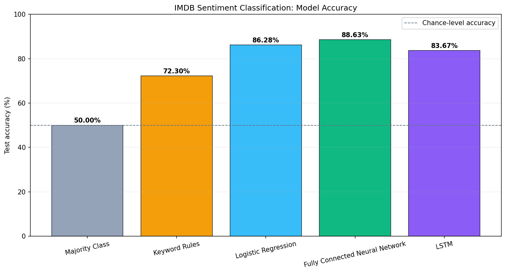
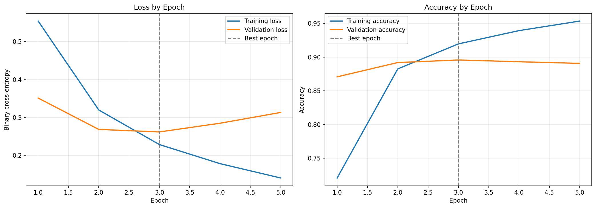

# IMDB Sentiment Classification

A compact machine learning project that compares simple baselines, classical
machine learning, and neural networks on binary sentiment classification.

The project uses the public Keras IMDB dataset and is intentionally scoped as
an educational benchmark: the goal is to measure what additional model
complexity contributes on the same task, not to present a production system.

## Results

| Model | Accuracy | Precision | Recall |
| --- | ---: | ---: | ---: |
| Majority class | 50.00% | 0.0000 | 0.0000 |
| Keyword rules | 72.30% | 0.7074 | 0.7605 |
| Logistic Regression | 86.28% | 0.8633 | 0.8621 |
| **Fully connected neural network** | **88.63%** | **0.8877** | **0.8844** |
| LSTM with embeddings | 83.67% | 0.8268 | 0.8519 |



The fully connected network achieved the highest test accuracy. Its improvement
over Logistic Regression was 2.35 percentage points, showing that the simpler
linear model remains a strong baseline. The LSTM underperformed both models in
this configuration, demonstrating that a more advanced architecture does not
automatically produce a better result.

## Method

- **Dataset:** 50,000 labeled IMDB movie reviews supplied by Keras
- **Task:** binary classification of positive and negative sentiment
- **Split:** 20,000 training, 5,000 validation, and 25,000 test reviews
- **Vocabulary:** 10,000 most frequent words
- **Representations:** binary bag-of-words and padded 200-token sequences
- **Evaluation:** accuracy, precision, and recall on the untouched test set

The dense network uses dropout and validation-loss early stopping. Validation
loss reached its minimum at epoch 3 and then increased while training
performance continued improving, indicating overfitting. The best epoch's
weights were restored before test evaluation.



## Repository

- [`IMDB_Classification_Project.ipynb`](IMDB_Classification_Project.ipynb):
  complete workflow, outputs, evaluation, and discussion
- `model_comparison.png`: comparison generated from the notebook's results table
- `training_history.png`: training and validation curves for the dense network
- `requirements.txt`: pinned dependencies used for the verified run

## Run Locally

Python 3.13 was used for the verified run.

```bash
python -m venv .venv
```

Activate the environment, then install dependencies:

```bash
python -m pip install -r requirements.txt
```

Open `IMDB_Classification_Project.ipynb` in VS Code or another Jupyter-compatible
editor and run all cells from top to bottom. The first dataset load downloads
the public IMDB dataset if it is not already cached.

Random seeds and deterministic TensorFlow operations are configured in the
notebook. Small numerical differences may still occur across operating systems,
hardware, and TensorFlow builds.

## Limitations

- Results use one predefined test split and one seeded training run.
- Hyperparameter tuning is limited rather than exhaustive.
- Bag-of-words features discard word order.
- The LSTM is a small educational comparison, not a modern language-model
  benchmark.
- Broader conclusions would require repeated runs and additional datasets.

## License

This project is available under the [MIT License](LICENSE).
